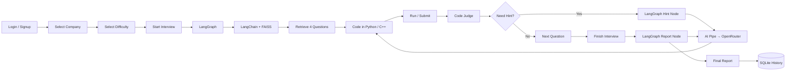
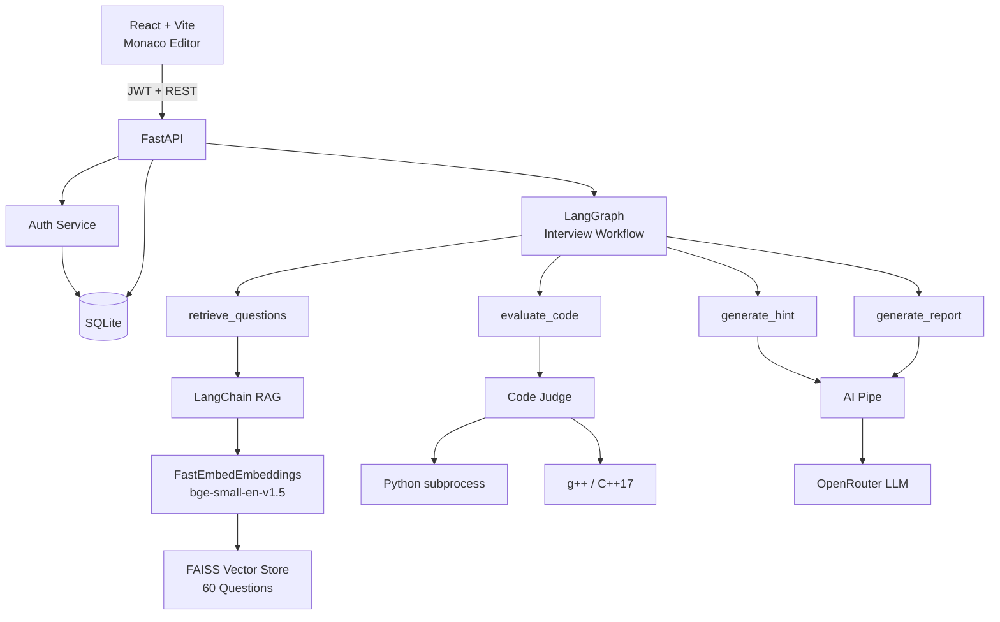

<div align="center">


[](https://git.io/typing-svg)


</div>

An AI-powered mock interview platform where candidates choose a company and difficulty, solve four semantically retrieved coding questions in Python or C++, run code against test cases, request contextual AI hints, and receive an AI-generated performance report with persistent interview history.

**60 curated questions · 5 companies · 300 test cases · Python + C++ · LangChain RAG · LangGraph orchestration**

---

## ✨ Features

- 🔐 **Secure authentication** — JWT sessions with PBKDF2-HMAC-SHA256 password hashing
- 🧠 **LangChain RAG** — `Document` + `FastEmbedEmbeddings` + FAISS semantic retrieval
- 🕸️ **LangGraph workflow** — routes retrieval, code evaluation, hint generation, and final reporting
- 💻 **Real code execution** — Python subprocess and C++17 via `g++`
- 🧪 **Visible + full test evaluation** — Run uses visible tests; Submit evaluates the complete test suite
- 💡 **AI hints, not answers** — model receives candidate code and judge context without revealing full solutions
- 📊 **AI performance reports** — score, strengths, weaknesses, and recommended next steps
- 🕘 **Per-user history** — reports are persisted in SQLite and scoped by `user_id`

## 🏗️ Tech Stack

| Layer | Technology |
|---|---|
| Frontend | React + Vite, Monaco Editor |
| Backend | FastAPI (Python) |
| Workflow Orchestration | **LangGraph `StateGraph`** |
| RAG Framework | **LangChain** |
| Retrieval | LangChain FAISS + `BAAI/bge-small-en-v1.5` |
| Embeddings | FastEmbed via `FastEmbedEmbeddings` |
| AI Layer | AI Pipe → OpenRouter |
| Auth | JWT + PBKDF2-HMAC-SHA256 |
| Database | SQLite |
| Execution | Python `subprocess` / `g++` (C++17) |
| Deployment | Hugging Face Docker Space |

## 🔄 Interview Workflow



## 📐 High-Level Design



### LangChain

```text
questions.json
      ↓
LangChain Documents
      ↓
FastEmbedEmbeddings
      ↓
FAISS Vector Store
      ↓
Company + Difficulty Filter
      ↓
Top 4 Relevant Questions
```

Only candidate-safe fields are embedded: **title, company, difficulty, topics, and problem statement**. Solutions and hidden tests are excluded.

### LangGraph

```text
START
  ↓
dispatch
  ├── retrieve_questions → LangChain + FAISS
  ├── evaluate_code      → Python/C++ Judge
  ├── generate_hint      → AI Pipe/OpenRouter
  └── generate_report    → AI Pipe/OpenRouter
  ↓
END
```

## ⚡ Local Quick Start

```bash
git clone <your-repo-url>
cd ai-coding-interview-agent

python -m venv .venv
.venv\Scripts\activate
pip install -r requirements.txt
copy .env.example .env

python -m app.rag.build_index
python scripts/test_langchain_langgraph.py
python -m uvicorn app.main:app --reload
```

In another terminal:

```bash
cd frontend
npm install
npm run dev
```

Backend docs: `http://127.0.0.1:8000/docs`  
Frontend: `http://localhost:5173`

## 🤗 Hugging Face Deployment

This repository is configured as a **Docker Space**. During the Docker build, React is compiled with Vite and the production files are served by the same FastAPI process on port `7860`.

### Space Secrets

Add these under **Space → Settings → Secrets**:

```text
AIPIPE_API_KEY
JWT_SECRET_KEY
```

### Space Variables

Add these under **Space → Settings → Variables**:

```text
AIPIPE_API_URL=https://aipipe.org/openrouter/v1/chat/completions
AIPIPE_MODEL=openrouter/free
DATABASE_PATH=/data/interview_agent.db
FASTEMBED_CACHE_DIR=/home/user/.cache/fastembed
```

For persistent user accounts and interview reports, mount persistent storage at `/data`. Without persistent storage, the SQLite database is not guaranteed to survive Space restarts.

### Deployment Runtime

```text
Browser
   ↓
Hugging Face Docker Space :7860
   ↓
FastAPI
   ├── React production UI
   ├── JWT authentication
   ├── LangGraph workflow
   ├── LangChain + FAISS RAG
   ├── Python/C++ judge
   └── AI Pipe → OpenRouter
```

> **Security:** the current candidate-code judge uses local subprocesses. It is intended for controlled/demo use. A hardened public deployment should execute untrusted code in a dedicated isolated sandbox.

## 🔌 API Reference

| Method | Endpoint | Purpose |
|---|---|---|
| POST | `/api/auth/signup` | Create account |
| POST | `/api/auth/login` | Authenticate user |
| GET | `/api/auth/me` | Get logged-in user |
| POST | `/api/interviews/start` | Retrieve 4 questions and start interview |
| GET | `/api/interviews/{id}/questions/{pos}` | Fetch interview question |
| POST | `.../run` | Evaluate visible tests |
| POST | `.../submit` | Evaluate complete test suite |
| POST | `.../hint` | Generate contextual AI hint |
| POST | `.../finish` | Score interview + generate AI report |
| GET | `.../solutions/{pos}` | View solution after interview |
| POST | `/api/reports` | Persist completed report |
| GET | `/api/reports` | Current user's interview history |

## 📂 Project Structure

```text
ai-coding-interview-agent/
 ├── app/
 │   ├── main.py
 │   ├── accounts.py
 │   ├── hf_frontend.py
 │   ├── interview_service.py
 │   ├── judge.py
 │   ├── aipipe.py
 │   ├── starter_code.py
 │   ├── question_store.py
 │   ├── graph/
 │   │   ├── state.py
 │   │   └── interview_graph.py
 │   └── rag/
 │       ├── embeddings.py
 │       ├── build_index.py
 │       └── retriever.py
 ├── data/
 │   ├── questions.json
 │   └── faiss/
 ├── frontend/
 ├── scripts/
 ├── Dockerfile
 ├── .dockerignore
 ├── requirements.txt
 ├── .env.example
 └── README.md
```

## 🧠 Dataset

| Company | Easy | Medium | Hard | Total |
|---|---:|---:|---:|---:|
| Amazon | 4 | 4 | 4 | 12 |
| Google | 4 | 4 | 4 | 12 |
| Microsoft | 4 | 4 | 4 | 12 |
| Meta | 4 | 4 | 4 | 12 |
| Goldman Sachs | 4 | 4 | 4 | 12 |
| **Total** | **20** | **20** | **20** | **60** |

Each problem contains **5 test cases**, giving **300 total test cases**.

Company labels are curated practice-targeting labels and do not claim that every exact problem was historically asked by that company.

## 🔒 Security Notes

- Passwords are hashed with **PBKDF2-HMAC-SHA256** and a unique salt.
- JWT protects authenticated application sessions.
- AI Pipe credentials never reach the React frontend.
- Reports are queried using the authenticated `user_id`.
- Solutions and hidden tests are excluded from RAG embeddings.
- The LLM provides hints/reports; **the deterministic judge decides correctness**.
- Candidate code currently runs in local subprocesses, so production public use requires stronger isolation.

## 🎯 Interview Talking Point

> **LangChain handles the RAG layer — document creation, FastEmbed embeddings, FAISS vector storage, metadata filtering, and semantic retrieval. LangGraph orchestrates the interview workflow — retrieval, deterministic code evaluation, contextual hint generation, and final AI reporting.**

## 📄 License

MIT — see [LICENSE](./LICENSE).

<div align="center">


</div>
